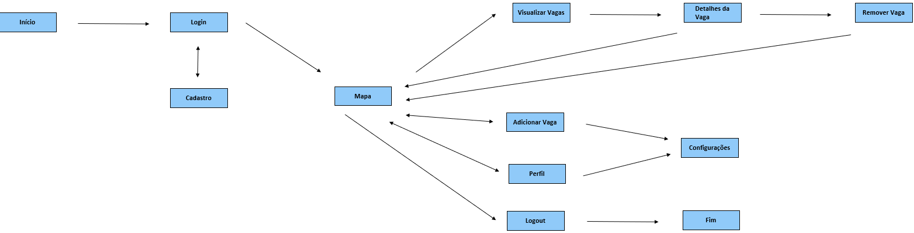
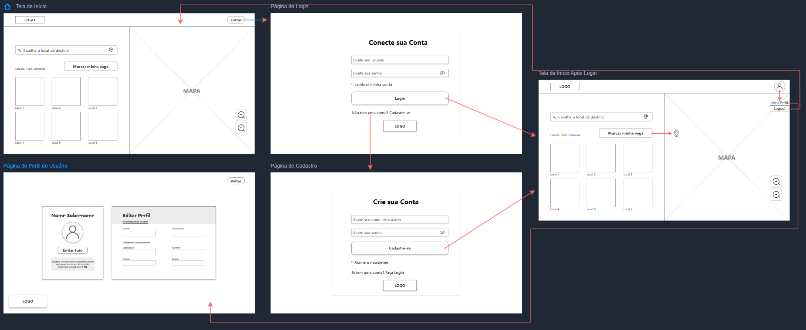
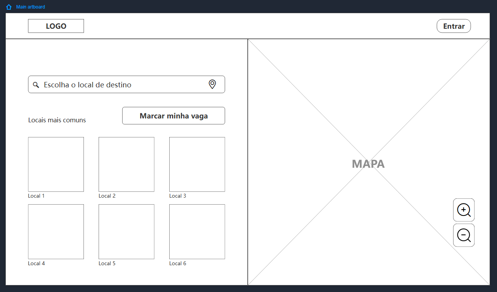
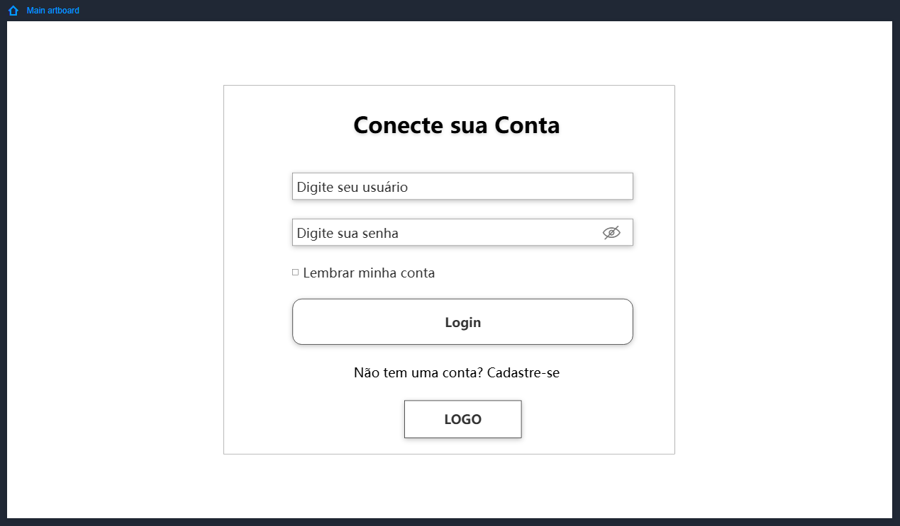
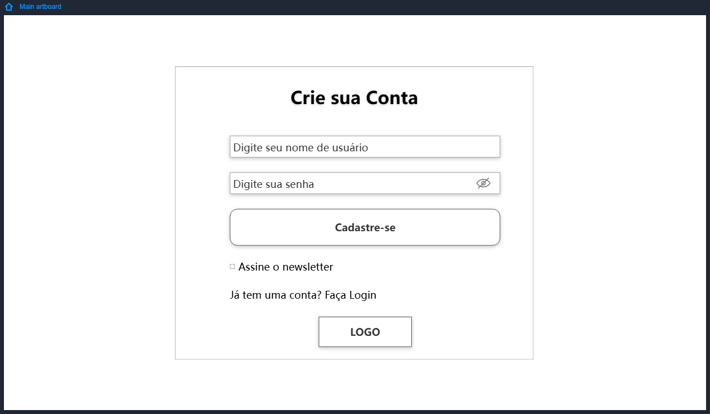
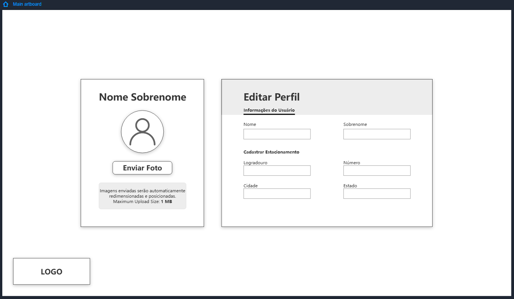
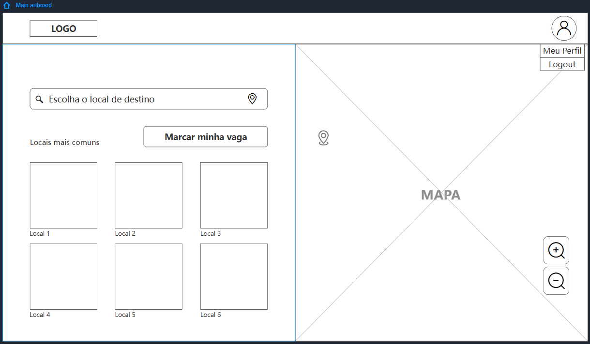

# Projeto de Interface

Visão geral da interação do usuário pelas telas do sistema e protótipo interativo das telas com as funcionalidades que fazem parte do sistema (wireframes).

## User Flow

Fluxo de usuário (User Flow) é uma técnica que permite ao desenvolvedor mapear todo fluxo de telas do site ou app. Essa técnica funciona para alinhar os caminhos e as possíveis ações que o usuário pode fazer junto com os membros de sua equipe.

**Esboço Userflow**

**Userflow Prototipado**

## Wireframes

São protótipos usados em design de interface para sugerir a estrutura de um site web e seu relacionamentos entre suas páginas. Um wireframe web é uma ilustração semelhante do layout de elementos fundamentais na interface e é fundamental sempre relacionar cada wireframe com o(s) requisito(s) que ele atende.

Abaixo está a página principal do projeto, contendo um input para seleção do destino, botão para marcação da vaga de estacionamento, botões contendo os locais mais comuns, mapa para visualização e marcação das vagas de estacionamento, botões de zoom in/out, e um botão de redirecionamento para a tela de login.

Esta é a tela de login, contendo inputs para informar login e senha, checkbox para salvar as informações, botão de login, e link de redirecionamento para a tela de cadastro.

Esta é a tela de cadastro, contendo inputs para registrar um nome de usuário e senha, botão de confirmação do cadastro, checkbox para manifestar interesse em assinar o newsletter, link para redirecionamento para a tela de login.

Abaixo está a página do perfil, contendo nome e sobrenome do usuário, botão para troca da imagem de perfil, inputs para troca de nome e sobrenome, bem como inputs para cadastro de estacionamento particular.

Esta é a tela principal após login/cadastro, contendo as preferências do usuário, menu hambúrguer contendo botão de redirecionamento para a página do perfil e botão para logout.

