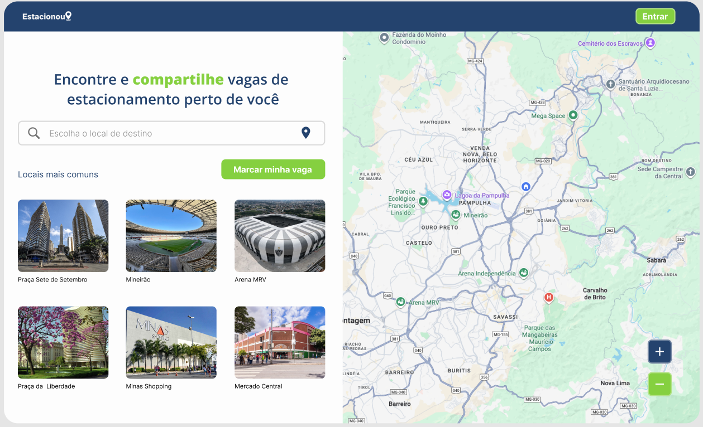

# Template padrão do site

Layout padrão do site (HTML e CSS) que será utilizado em todas as páginas com a definição de identidade visual, aspectos de responsividade e iconografia.

## Design

**Página Inicial**

**Página de Login**

**Página de Cadastro**

**Página do Perfil**

## Cores

## Tipografia

**OpenSans**: Título de página

**Inter**: Título de Seção, Rótulos de componentes e Corpo de Texto.

## Iconografia

Os ícones acima serão utilizados como marcadores no mapa, de modo a informar ao usuário a disponibilidade de vagas de estacionamento e se são reservadas para público específico.

A prototipação/design foi realizada no figma e está disponível para acesso: [Clique para acessar o projeto](https://www.figma.com/design/c9R7UeOQhN5rUV87W5allO/Estacionei?node-id=55-26&p=f&t=krrmC5zXeIMuPNnH-0)

> **Links Úteis**:
>
> -  [Como criar um guia de estilo de design da Web](https://edrodrigues.com.br/blog/como-criar-um-guia-de-estilo-de-design-da-web/#)
> - [CSS Website Layout (W3Schools)](https://www.w3schools.com/css/css_website_layout.asp)
> - [Website Page Layouts](http://www.cellbiol.com/bioinformatics_web_development/chapter-3-your-first-web-page-learning-html-and-css/website-page-layouts/)
> - [Perfect Liquid Layout](https://matthewjamestaylor.com/perfect-liquid-layouts)
> - [How and Why Icons Improve Your Web Design](https://usabilla.com/blog/how-and-why-icons-improve-you-web-design/)
